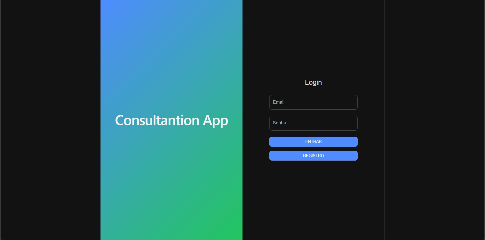
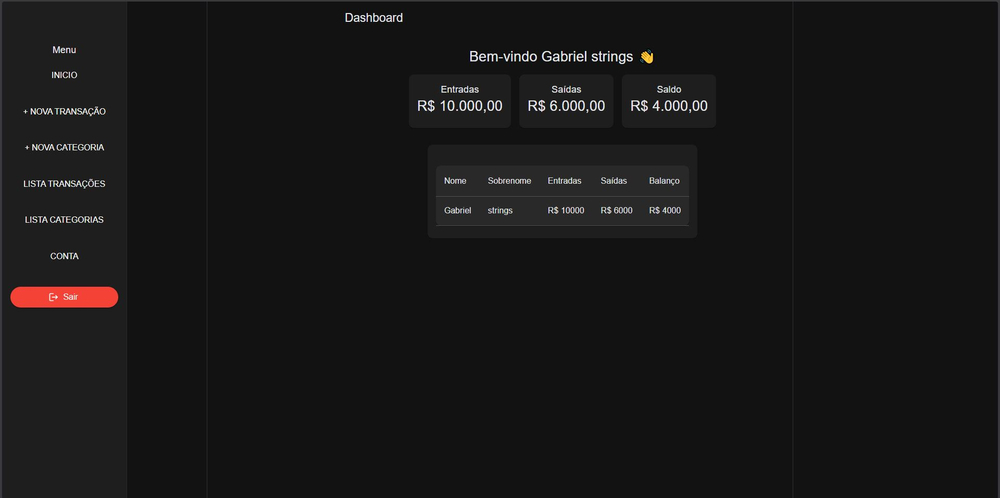
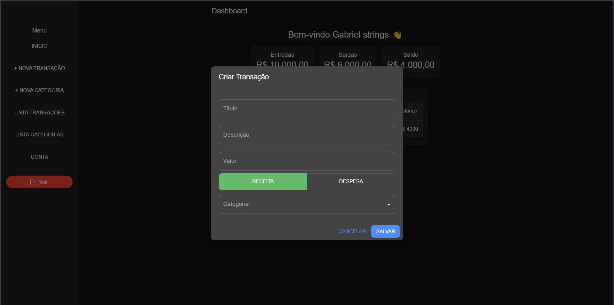
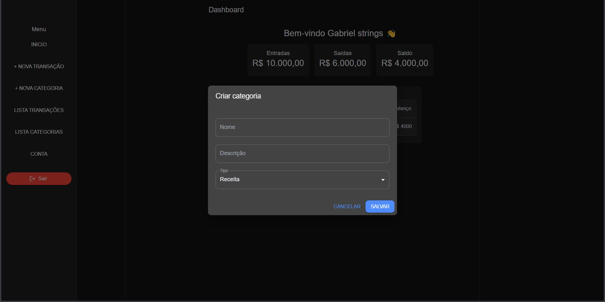
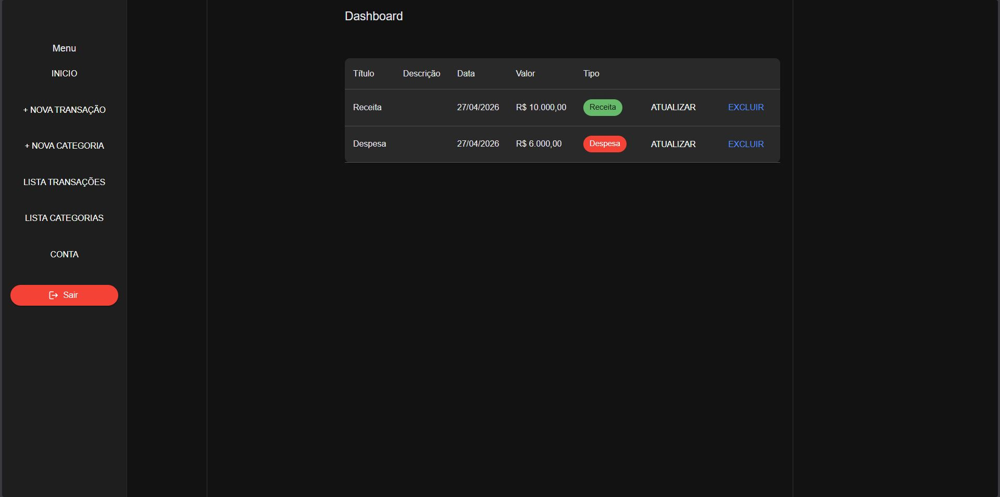
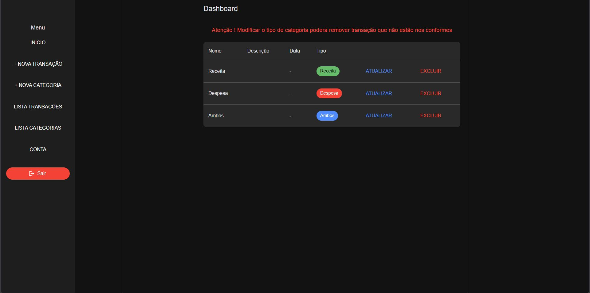

# Finance Dashboard

Aplicação fullstack para controle financeiro pessoal, com autenticação JWT, categorias personalizadas e gerenciamento de transações.

---

## 🚀 Tecnologias Utilizadas

### Frontend

* React
* TypeScript
* Vite
* Material UI
* Axios

### Backend

* .NET
* ASP.NET Core
* Entity Framework Core
* SQL Server
* JWT Authentication

---

## 📌 Funcionalidades

* Cadastro e login de usuários
* Autenticação JWT
* Logout seguro
* Dashboard protegido
* Cadastro de categorias (Receita / Despesa)
* Cadastro de transações
* Seleção de categoria ao criar transação
* Cálculo de receitas, despesas e balanço
* Persistência de sessão

---

## ⚙️ Como Rodar o Projeto

### Frontend

```bash
npm install
npm run dev
```

### Backend

```bash
dotnet restore
dotnet run
```

---

## 🔐 Variáveis de Ambiente

### Frontend `.env`

```env
VITE_API_URL=
```

### Backend `.env`

```env
ConnectionStrings__DefaultConnection=
JwtSettings__Secret=
JwtSettings__Issuer=
JwtSettings__Audience=
```

### Index


### Dashboard


### Add Transaction


### Add Category


### List Transaction


### List Category


---

## 👨‍💻 Autor

Gabriel Lima Bertoldo
